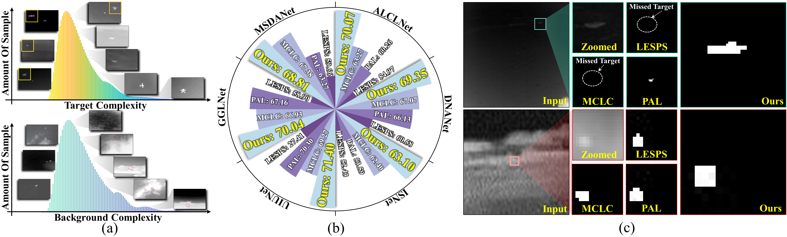
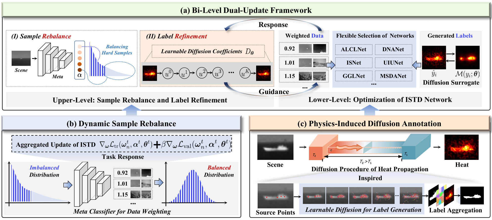
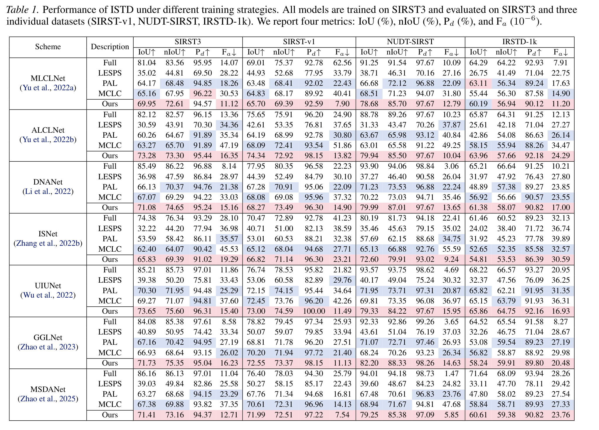
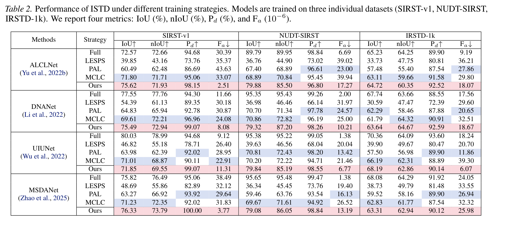
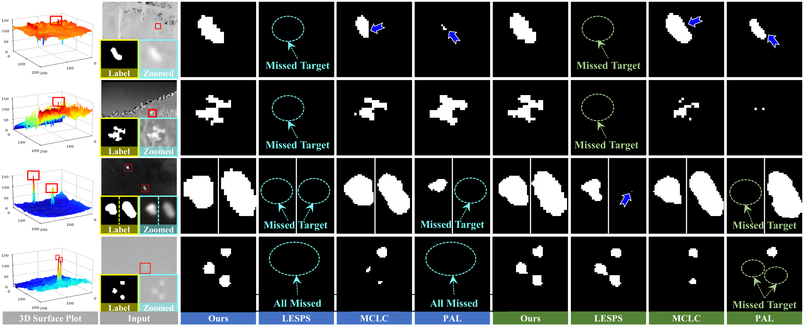

# Diffuse to Detect (ICML 2026 Spotlight)

<div align="center">
<h3>Diffuse to Detect: Bi-Level Sample Rebalancing with Pseudo-Label Diffusion for<br>
Point-Supervised Infrared Small-Target Detection</h3>

[](#)
[](#)
[](#)
[](LICENSE)

[arXiv](https://arxiv.org/abs/xxxx.xxxxx)

</div>

## Introduction

**Diffuse to Detect** targets point-supervised infrared small-target detection (ISTD), where only one point is annotated for each target. Point supervision greatly reduces annotation cost, but two issues remain challenging: pseudo-labels can evolve unstably in cluttered low-contrast infrared images, and ISTD datasets are highly imbalanced across target/background complexity.

The proposed framework addresses these issues with three key designs:

- **Physics-induced diffusion annotation:** each point annotation is treated as a thermal source, and a diffusion process expands it into a more reliable pseudo-mask.
- **Bi-level sample rebalancing:** sample-wise loss weights are dynamically predicted to reduce the dominance of easy or noisy samples.
- **Dual update for labels and samples:** detector weights, sample weights, and diffusion parameters are optimized with validation-guided feedback.

<p align="center">
  
</p>

> Motivation and efficiency overview.

<p align="center">
  
</p>

> Overview of the proposed framework.

## News

- `[2026-05-11]` Code released.

## Code Usage

### Step 1. Clone this repository and create environment

```bash
git clone https://github.com/yuanhang-yao/diffuse-to-detect.git
cd diffuse-to-detect

conda create -n diffuse-to-detect python=3.10 -y
conda activate diffuse-to-detect
pip install -r requirements.txt
```

### Step 2. Prepare datasets

| Dataset | Download |
|---|---|
| SIRST-v1 | [YimianDai/sirst](https://github.com/YimianDai/sirst) |
| NUDT-SIRST | [YeRen123455/Infrared-Small-Target-Detection](https://github.com/YeRen123455/Infrared-Small-Target-Detection) |
| IRSTD-1k | [RuiZhang97/ISNet](https://github.com/RuiZhang97/ISNet) |
| SIRST3 | [YuChuang1205/PAL](https://github.com/YuChuang1205/PAL) |

Expected directory structure:

```text
datasets/
└── SIRST3/
    ├── image_info_centroid/
    ├── images/
    ├── labels/
    └── mode/
        ├── train.txt
        ├── val.txt
        └── test.txt
```

### Step 3. Generate single-point priors

```bash
cd utils
python generate_single_point_Prior.py \
  --dataset_root ../datasets/SIRST3 \
  --save_dir ../datasets/SIRST3/masks_centroid
cd ..
```

### Step 4. Train

```bash
python train.py \
  --model alclnet \
  --dataset_root ./datasets/SIRST3 \
  --epochs 400 \
  --batch_size 16 \
  --lr 5e-4 \
  --gpu_id 0 \
  --save_dir ./checkpoints/diffuse2detect_alclnet
```

### Step 5. Test

```bash
python test.py \
  --model alclnet \
  --dataset_root ./datasets/SIRST3 \
  --checkpoint ./checkpoints/diffuse2detect_alclnet/best.pth \
  --output_dir ./outputs/diffuse2detect_alclnet \
  --gpu_id 0
```

## Main Results

<details>
<summary><strong>Quantitative results on SIRST3 and individual datasets</strong></summary>
<p align="center">
  
</p>
</details>

<details>
<summary><strong>Quantitative results when trained on individual datasets</strong></summary>
<p align="center">
  
</p>
</details>

<details>
<summary><strong>Qualitative comparison</strong></summary>
<p align="center">
  
</p>
</details>

## Citation

If this project is useful for your research, please cite:

```bibtex
@inproceedings{liu2026diffuse,
  title     = {Diffuse to Detect: Bi-Level Sample Rebalancing with Pseudo-Label Diffusion for Point-Supervised Infrared Small-Target Detection},
  author    = {Liu, Zhu and Yao, Yuanhang and Qian, Ping and Chen, Zihang and Liu, Risheng},
  booktitle = {International Conference on Machine Learning},
  year      = {2026}
}
```

## Acknowledgement

This repository builds on the ISTD community and compares with single-point baselines including [LESPS](https://github.com/XinyiYing/LESPS), [MCLC](https://github.com/YeRen123455/SIRST-Single-Point-Supervision), and [PAL](https://github.com/YuChuang1205/PAL). Please cite the corresponding original works when using their code, datasets, or annotations.
